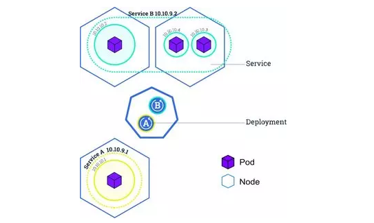
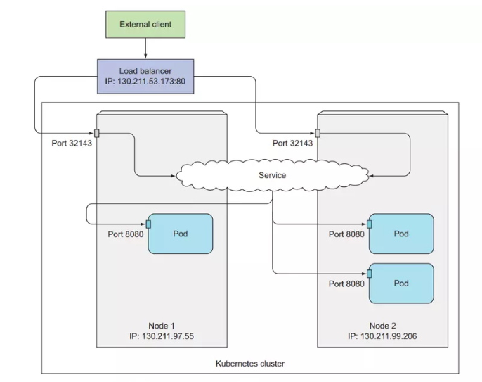
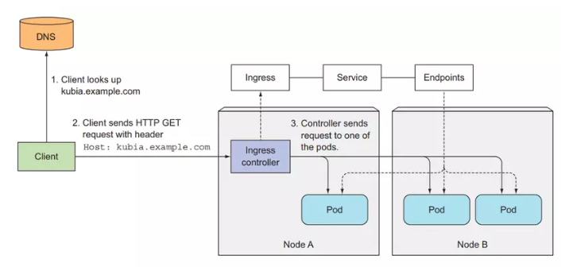

# Services: expose traffic cho pod

Một resource cho phép chúng ta ra expose traffic cho Pod, để Pod có thể giao tiếp và xử lý request từ client.



## Pods are ephemeral

Pod là 1 resource rất phù du, nó được tạo ra, bị xóa và thay thế bằng 1 pod khác bất cứ lúc nào. Khi tạo mới Pod nó sẽ có 1 IP khác với Pod cũ. Nếu dùng IP của Pod để tạo connection tới client thì lúc Pod được thay thế với IP khác thì ta sẽ phải update lại code.

## Multiple Pod run same application

Ta sẽ có nhiều Pod đang chạy 1 ứng dụng của chúng ta để tăng performance. VD: ta dùng ReplicaSet với replicas = 3, nó sẽ tạo ra 3 Pod.

## ClusterIP

Loại service này sẽ tạo 1 IP và DNS mà sẽ có thể truy cập bên trong cluster, không thể truy cập từ bên ngoài, được dùng chủ yếu cho các Pod ở bên trong cluster dễ dàng giao tiếp với nhau.

ClusterIP giúp các ứng dụng deploy trong cluster của ta giao tiếp với nhau dễ dàng hơn. Nếu muốn client truy cập từ bên ngoài vào thì chúng ta có 3 cách là NodePort, `LoadBalancer`(hỗ trợ cloud), Ingress.

## NodePort

Đây là cách để expose Pod cho client bên ngoài có thể truy cập vào được Pod bên trong cluster. NodePort sẽ tạo endpoint có thể truy cập vào bên trong cluster bằng IP và DNS, nó sẽ sử dụng 1 port của toàn bộ worker node để client bên ngoài có thể giao tiếp được với Pod của chúng ta thông qua port đó. NodePort sẽ có range mặc định từ 30000-32767.


Client có thể gửi request tới Pod bằng địa chỉ 172.16.10.109:31000 hoặc 172.16.10.101:31000. Tạo NodePort service:
```
apiVersion: apps/v1
kind: ReplicaSet
metadata:
  name: hello-rs
spec:
  replicas: 2
  selector:
    matchLabels:
      app: hello-kube
  template:
    metadata:
      labels:
        app: hello-kube
    spec:
      containers:
      - image: 080196/hello-kube
        name: hello-kube
        ports:
          - containerPort: 3000

---
apiVersion: v1
kind: Service
metadata:
  name: hello
spec:
  selector:
    app: hello-kube
  type: NodePort
  ports:
    - port: 3000
      targetPort: 3000
      nodePort: 31000
```

## LoadBalancer

Khi chạy k8s trên cloud, nó sẽ hỗ trợ LoadBalancer Service, nếu bạn chạy trên môi trường không có hỗ trợ LoadBanlancer thì sẽ không thể tạo được loại service này. Khi tạo LoadBanlancer, nó sẽ tự tạo 1 public IP.



## Ingress resource

Ingress cho phép expose HTTP và HTTPS router từ bên ngoài cluster tới service bên trong cluster. Ingress sẽ gán 1 domain thực tế với service bên trong cluster.



