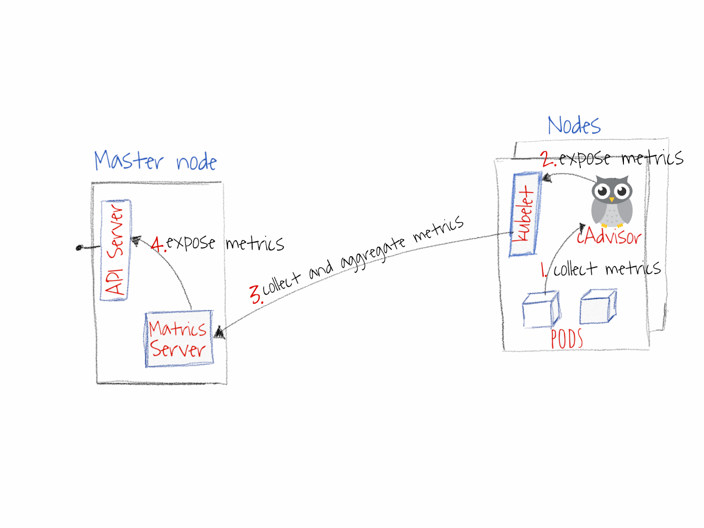
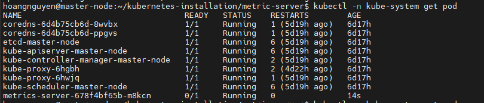
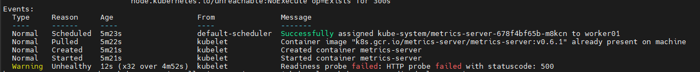
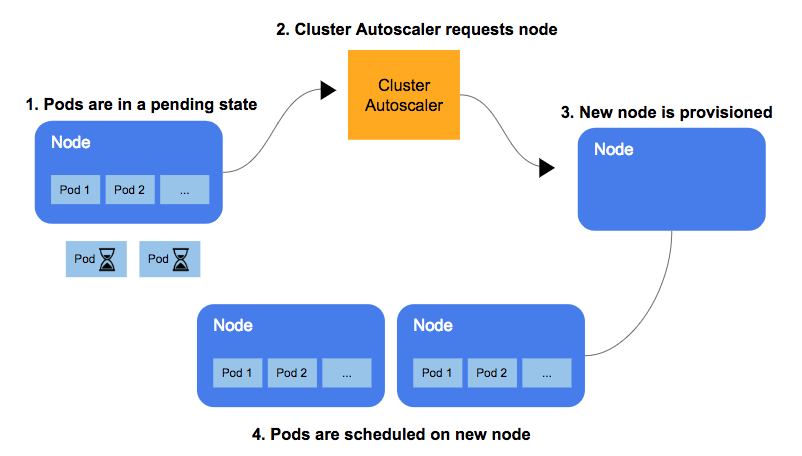

# HPA - Horizontal Pod Autoscaling

HPA đem lại lợi ích: kinh tế, tự động hóa việc tăng giảm cấu hình hệ thống phù hợp với các hệ thống có khối lượng tải (mức enduser) biến đổi nhiều và khó dự đoán

So với mô hình "truyền thống" kiểu fix cứng số lượng các Pods, auto scaling thích ứng để phù hợp với nhu cầu sử dụng. VD, khi lượng truy cập vào hệ thống vào buổi đêm giảm xuống, các Pods có thể được set vào sleep mode (sleep mode để dễ dàng bật lại ngay đối phó với sự tăng bất lường từ lượng truy cập)

## Metrics Server

Là 1 server tập hợp lại các metrics (chỉ số đo lường) của các container(các Pods) phục vụ cho chu trình autoscaling tích hợp trong k8s



Các bước trên sơ đồ:
1. Các metrics (mức sử dụng RAM, CPU) được thu thập từ các Pods
2. Các metrics này sẽ được đẩy đến `kubelet`
3. Metrics Server thu thập metrics qua `kubelet`
4. Metrics được đẩy đến API server, HPA sẽ gọi API này để lấy các metrics, tính toán để scale pods

Cài đặt Metrics Server:
```
kubectl apply -f https://github.com/kubernetes-sigs/metrics-server/releases/latest/download/components.yaml
```

Kiểm tra trạng thái service vừa tải về:
```
kubectl -n kube-system get pod
```



Kiểm tra describe pod:
```
kubectl -n kube-system describe pod <metrics-server....>
```


Sửa lại metrics-server:
```
kubectl -n kube-system edit deploy metrics-server
```
Thêm phần command vào file.
```
containers:
      - args:
        - --cert-dir=/tmp
        - --secure-port=4443
        - --kubelet-preferred-address-types=InternalIP,ExternalIP,Hostname
        - --kubelet-use-node-status-port
        - --metric-resolution=15s
        command:
        - /metrics-server
        - --kubelet-insecure-tls
        - --kubelet-preferred-address-types=InternalIP
```

Kiểm tra lại bằng câu lệnh:
```
kubectl top node
```

## Cluster Auto-Scaler

Khi `ban điều hành` HPA tăng số lượng Pod, thì node cũng cần phải tăng lên để đáp ứng số Pod mới này.

`Cluster Auto-Scaler` là một chức năng trong K8s, chịu trách nghiệm tăng/giảm số lượng của node sao cho phù hợp với số lượng Pods vận hành

`Cluster Auto-Scaler` sẽ điều chỉnh tự động kích thước của Kubernetes cluster (hay số nodes) khi một trong các điều kiện sau thỏa mãn:
- Một số Pods run bị fail trong cluster do lý do không đủ tài nguyên
- Có node trong cluster không được sử dụng hết công suất, các Pods của nó có thể vận hành được trên các node khác mà có tài nguyên đang dư giả


## Cấu hình Autoscanling với HPA

Tạo 1 deployment gồm 1 Pod chạy Apache và 1 service trỏ tới Pod đó. Sau đó cấu hình HPA cho Deployment đó với điều kiện tải CPU của Pod > 50% thì sẽ scale số pod lên, và khi tải giảm xuống thì số Pod cũng được giảm theo.

Tạo file deployment php-apache.yaml như sau:
```
apiVersion: apps/v1
kind: Deployment
metadata:
  name: php-apache
spec:
  selector:
    matchLabels:
      run: php-apache
  replicas: 1
  template:
    metadata:
      labels:
        run: php-apache
    spec:
      containers:
      - name: php-apache
        image: k8s.gcr.io/hpa-example
        ports:
        - containerPort: 80
        resources:
          limits:
            cpu: 500m
          requests:
            cpu: 200m
---
apiVersion: v1
kind: Service
metadata:
  name: php-apache
  labels:
    run: php-apache
spec:
  ports:
  - port: 80
  selector:
    run: php-apache
```

Apply file để tạo deployment và service:
```
kubectl apply -f php-apache.yaml
```

Cấu hình HPA cho deployment này để khi các Pod tăng tải sẽ được autoscale:
```
kubectl autoscale deployment php-apache --cpu-percent=50 --min=1 --max=10
kubectl get hpa
```

Ta chạy 1 Pod gọi liên tục tới php-apache. Sử dụng 2 màn hình terminal, 1 màn hình để chạy pod để generate load, màn hình còn lại để theo dõi trạng thái của deployment để xem autoscale như thế nào
```
kubectl run -i --tty load-generator --rm --image=busybox:1.28 --restart=Never -- /bin/sh -c "while sleep 0.01; do wget -q -O- http://php-apache; done"
```

Màn hình còn lại:
```
kubectl get hpa php-apache --watch
```