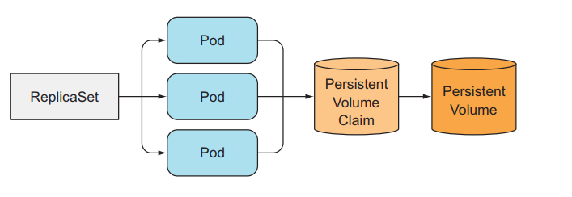
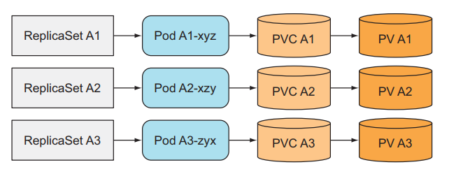
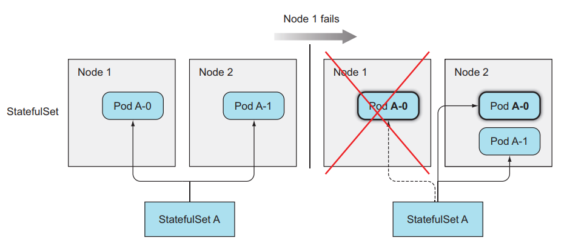
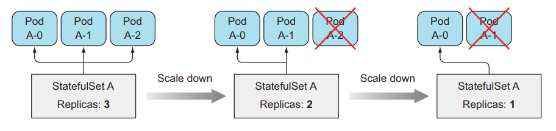
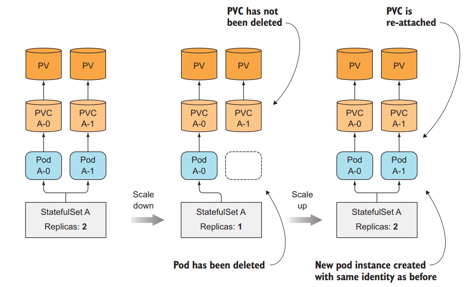

# Stateful/Stateless

## Stateful application

Yêu cầu có trạng thái (state) của chính nó, và cần lưu lại state đó, hoặc yêu cầu phải có lưu trữ dữ liệu mà cần persistent storage, dữ liệu này sẽ được sử dụng bởi client và các app khác. VD: database sẽ có dữ liệu riêng của nó.

## Stateless application

Là ứng dụng mà không có lưu trữ trạng thái của chính nó, hoặc không có lưu trữ dữ liệu mà cần persistent storage. VD: 1 web server API mà không có lưu trữ hình ảnh, hoặc session login của user, thì đó là 1 stateless apps, bởi vì dù ta có xóa ứng dụng và tạo lại bao nhiêu lần thì cũng không ảnh hướng đến dữ liệu người dùng. Bởi vì dữ liệu của ta được lưu trữ thông qua database, web server API chỉ kết nối với database và lưu trữ dữ liệu chứ nó không có dữ liệu của chính nó.

## Hạn chế của việc sử dụng ReplicaSet để tạo replicated stateful app

ReplicaSet tạo nhiều Pod relicas từ 1 Pod template, nên các Pod được relicated đó không khác gì các Pod khác ngoại trừ tên và IP. Nếu ta config volume trong Pod template thì tất cả các Pod được replicated đều lưu trữ dữ liệu chung 1 storage

Ta không sử dụng 1 ReplicatSet rồi set thuộc tính replicas của nó để chạy 1 ứng dụng distributed data store (Kho dữ liệu phân tán) được.

## Tạo nhiều ReplicaSet chỉ có 1 Pod mỗi ReplicaSet

Tạo nhiều ReplicaSet và cho mỗi ReplicaSet 1 template Pod khác nhau

Có thể sử dụng cách này để deploy 1 ứng dụng distributed data store, nhưng đây không phải cách tốt.

## StatefulSets

Giống như ReplicaSet, StatefulSet là 1 resource giúp chúng ta chạy nhiều Pod mà cùng 1 template bằng cách set thuộc tính replicas, nhưng khác với ReplicaSet ở chỗ là Pod của StatefulSet sẽ được định danh chính xác và mỗi thằng sẽ có 1 stable network identity của riêng nó.

Mỗi Pod được tạo ra bởi StatefulSet sẽ được gán với 1 index, index này sẽ sử dụng để định danh cho mỗi Pod. Tên của Pod sẽ được đặt theo kiểu `<statefulset name>-<index>`, chứ không random như của ReplicaSet

### Cách StatefulSets thay thế 1 Pod bị mất

Khi 1 Pod mà được quản lý bởi 1 StatefulSets mà bị mất (do ai đó xóa đi), thằng StatefulSets sẽ tạo ra 1 Pod mới để thay thế Pod cũ tương tự như cách làm của ReplicaSet, nhưng Pod mới được tạo ra sẽ có tên và hostname giống y như Pod cũ bị mất.

### Cách StatefulSets scale Pod

Khi ta scale up Pod trong StatefulSets, nó sẽ tạo ra 1 Pod mới được đánh index là số tiếp theo của index hiện tại. VD: StatefulSets có replicas = 2, sẽ có 2 Pod là `<pod-name>-0`, `<pod-name>-1`, khi ta scale up Pod lên bằng 3, Pod mới được tạo ra sẽ có tên là `<pod-name>-2`. Tương tự như scale down, nó sẽ xóa Pod với index lớn nhất. Đối với StatefulSets thì khi ta scale up và scale down thì ta có thể biết chính xác tên của Pod được tạo ra và xóa đi.

### Cung cấp storage riêng biệt cho mỗi Pod

Khi ta scale up Pod trong StatefulSets, thì sẽ có 1 Pod và 1 PersistentVolumeClaims mới được tạo ra, nhưng khi ta scale down thì chỉ có Pod bị xóa đi còn PersistentVolumeClaims vẫn giữ ở đó và không bị xóa. Để khi ta scale up lại thì Pod vẫn được gán đúng với PersistentVolumeClaims đó để dữ liệu vẫn giữ nguyên.

