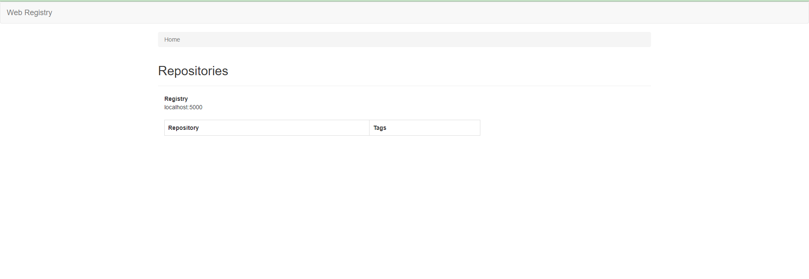

# Docker Registry là gì ?

Là nơi chứa các Image trong quá trình khởi động các container.

## Cài đặt Docker

Bước 1: Cập nhật apt
```
$ sudo apt update
$ sudo apt upgrade
```

Bước 2: Download và cài đặt docker
```
$ sudo apt install docker.io
```

Bước 3: Khởi chạy docker
Kích hoạt docker tự động khởi chạy khi hệ thống được reboot
```
$ sudo systemctl enable --now docker
```

Bước 4: Thiết lập đặc quyền
Thiết lập đặc quyền truy cập docker bất kỳ user nào.
```
$ sudo usermod -aG docker "user" && newgrp docker
```

Bước 5: Kiểm tra phiên bản docker
```
$ docker --version
```

## Cài đặt Docker Registry

Cài đặt Docker Registry v2 bằng lệnh:
```
docker run -d -p 5000:5000 --restart=always --name registry-srv registry:2
```
Trong đó : 
- -p 5000:5000 : Map port 5000 của host và container
- -restart=always : luôn luôn bật container
- registry-srv : tên container
- registry:2 : tên image

## Cài đặt Web UI cho Registry

Tạo file config:
```
mkdir -p /opt/conf

cd  /opt/conf

sudo nano config.yml
```
Thêm nội dung file : 
```
registry:
   # Docker registry url
   url: http://registry-srv:5000/v2
   # Docker registry fqdn
   name: localhost:5000
   # To allow image delete, should be false
   readonly: false
   auth:
   # Disable authentication
   enabled: false
```
Trong đó :
- readonly: false : cho phép xóa image
- enabled: false : không cần login registry

## Cài đặt Web UI cho Registry

```
docker run -it -p 8000:8080 --restart=always --name registry-web --link registry-srv -v $(pwd)/config.yml:/conf/config.yml:ro hyper/docker-registry-web
```
Trong đó :
- -p 8000:8080: Map port 8000 của host và container
- -restart=always : luôn bật container
- registry-web : tên container
- link registry-srv : liên kết với docker registry container đã tạo ở trên
- hyper/docker-registry-srv : tên image



Pull image :
```
docker pull centos:latest
```

Tạo image tag cho registry
```
docker image tag centos 172.16.10.109:5000/centos:latest
```

Push image lên Docker Registry
```
docker push 172.16.10.109:5000/centos:latest
```

