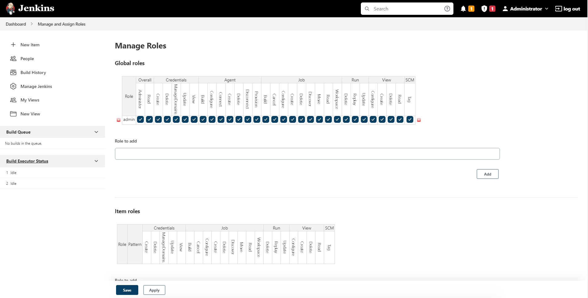
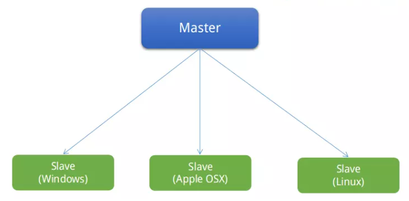

# Jenkins là gì?

Là 1 chương trình mà nguồn mở thực hiện chức năng tích hợp liên tục (CI) và xây dựng các tác vụ tự động hóa. Chức năng của `Jenkins` là thực hiện danh sách các bước đã được định trước. VD: Biên dịch mã nguồn Java và xây dựng ứng dụng JAR từ các lớp kết quả.

Các bước có thể thực hiện bởi `Jenkins` như:
- Thực hiện 1 xây dựng phần mềm bằng cách sử dụng 1 hệ thống xây dựng như Apache, Maven hoặc Gradle
- Thực hiện 1 kịch bản shell script.
- Lưu trữ kết quả build
- Chạy thử phần mềm

Jenkins giám sát việc thực hiện các bước và cho phép ngừng quá trình, nếu 1 trong các bước không thành công, Jenkins cũng có thể gửi thông báo trong trường hợp xây dựng thành công hoặc thất bại. Jenkins có thể được mở rộng bằng các trình cắm thêm bổ sung.

## Cài đặt

### Cài đặt Java Runtime cho Jenkins

Để chạy Jenkins cần phiên bản Java 8

### Cài đặt Jenkins

Thêm thông tin **GPG Key** của Jenkins
```
# sudo wget -q -O - https://pkg.jenkins.io/debian-stable/jenkins.io.key | sudo apt-key add -
```

Thêm thông tin **Jenkins Repository** vào hệ thống rồi cập nhật lại thông tin Repo
```
# sudo echo 'deb https://pkg.jenkins.io/debian-stable binary/' > /etc/apt/sources.list.d/jenkins.list
# sudo apt update
```

Cài đặt Jenkins
```
# sudo apt install jenkins -y
```

Cài qua Repository hay gói package .deb thì sẽ có các thuận lợi sau:
- Jenkins sẽ hỗ trợ startup script cho service Jenkins luôn thay vì chạy đơn lẻ file java.jar.
- User 'Jenkins' sẽ được khởi tạo để dùng cho service Jenkins.
- Các thư mục cấu hình, hoạt động của Jenkins sẽ gồm: /var/log/jenkins/, /var/lib/jenkins/, /var/cache/jenkins . Owner của các folder này là user ‘jenkins’.
- File cấu hình thông tin global : /etc/sysconfig/jenkins
- File log Jenkins : /var/log/jenkins/jenkins.log

Kiểm tra phiên bản Jenkins tại file cấu hình
```
# systemctl start jenkins
# cat /var/lib/jenkins/config.xml  | grep -i "version"
```

### Khởi động Jenkins

Khởi động Jenkins và kích hoạt startup-service cho Jenkins
```
# systemctl start jenkins
# systemctl enable jenkins
# systemctl status jenkins
```

Jenkins lắng nghe request ở port mặc định là 8080 TCP.
```
# netstat -atnp | grep 8080
```

### Mở firewall rule cho Jenkins

```
# iptables -P INPUT -p tcp --dport 8080 -j ACCEPT
```

### Truy cập Jenkins - setup cơ bản

Đăng nhập vào link ip server Jenkins và port 8080 sẽ thất thông báo 'Unlock Jenkins' nhằm đảm bảo người truy cập là quản trị viên. Jenkins yêu cầu phải lấy thông tin chuỗi mật khẩu chứa ở file
```
# cat /var/lib/jenkins/secrets/initialAdminPassword
```

### Quản lý role

Vào **Manage Roles** sẽ thấy 1 role admin, role admin này được cấp full tất cả mọi quyền


Role ở đây bao gồm:
- Global roles: Các role này có tầm ảnh hưởng tới toàn bộ hệ thống, nghĩa là 1 User A được gán role X có quyền build job, thì User A này có khả năng build mọi job của Project.

## Tìm hiểu về CI và CD trong Jenkins

### CI

CI(Continuous Integration) là tích hợp liên tục nhằm liên tục tích hợp các source code của những thành viên có trong team lại 1 cách nhanh chóng hơn.
Chu trình làm việc như sau:
- Các thành viên trong team dev sẽ bắt đầu pull code mới nhất từ repo về branch để có thể thực hiện được các yêu cầu chức năng nhất định.
- Quá trình lập trình và test code để có thể đảm bảo được mọi chất lượng với chức năng cũng như toàn bộ source code.
- Các thành viên code xong thì sẽ làm cho việc commit vào branch develop của team.
- Các thành viên sẽ cập nhật code mới ngay từ repo về local repo
- Merge code sẽ giải quyết được conflict
- Build và chú trọng đảm bảo code pass thông qua các tests ở dưới local
- Commit code lên repo
- Các máy chủ CI sẽ lắng nghe các thay đổi code từ repository và có thể tự động build/test. Sau đó, đưa ra những thông báo lại cho các thành viên.

### CD

CD (Continuous Delivery) là chuyển giao liên tục cũng như tập hợp các kỹ thuật giúp kiểm tra tích cực source code trên chính môi trường staging (môi trường staging là một bản sau gần chính xác của môi trường sản xuất để kiểm thử phần mềm).
Với cách như thế này thì có thể đảm bảo rằng source code được review, quá trình kiểm thử 1 cách tỉ mỉ trước khi deploy lên với môi trường production (Môi trường production là nơi quan trọng nhất, là nơi mà người dùng cuối họ truy cập sau tất cả các công đoạn cập nhật và thử nghiệm).

### Jenkins Pipeline

Là 1 bộ plugin giúp hỗ trợ việc triển khai cũng như tích hợp CD dựa theo kiểu pipeline. Quá trình này bao gồm: Tập hợp các quy trình với những tác vụ có liên quan tới nhau và được thực hiện theo 1 cách tuần tự dựa theo thứ tự đã được định sẵn. Khi đó, Jenkins pipeline sẽ được khai báo ngay trên 1 tập tin được gọi là Jenkinsfile.

### Jenkinsfile

Là phần lõi của Jenkins Pipeline, nó được viết dựa vào cú pháp DSL với ngôn ngữ chính là: Groovy DSL. Là tập tin có chứa danh sách những công việc mà pipeline sẽ thực hiện. Nó được lưu ở trên server Jenkins hoặc ở repo của git, bitbucket. Bộ phận Jenkinsfile sẽ thực hiện các tác vụ :
- Thiết lập các biến của môi trường
- Pull code từ git repo đã được chỉ định sẵn
- Thiết lập Jenkins workspace
- Thực thi các đoạn script đã được chỉ định sẵn
- Sau khi thực hiện xong thì nó có nhiệm vụ dọn dẹp cho workspace

Các nội dung có trong Jenkinsfile:
- `pipeline{}` : là 1 thành phần bắt buộc được sử dụng để có thể khai báo pipeline ở trong jenkinsfile
- `agent` : được sử dụng để khai báo môi trường được thực hiện, nếu như cấu hình là any thì Jenkins có thể swe dụng được bất kỳ agent nào đang hiện có trên hệ thống
- `environment{}` : được sử dụng để thực hiện khai báo cho các biến môi trường cần thiết nhất.
- `stages{}` : sử dụng để khai báo những giai đoạn con có bên trong pipeline
- `post{}` : dùng để thực thi ngay sau khi các stage hoàn tất được các công việc đã được chỉ định. Trong jenkinsfile trên, sau khi các stage đã thực hiện workspace thì sẽ được xóa để tránh cho jenkins không bị lỗi trong lần thực thi pipeline tiếp theo.

## Kiến trúc Master/Slave

Jenkins master là 1 machine mà jenkins đã được cài đặt trên đó, chẳng hạn như đó là 1 Linux PC, nhằm thực hiện 1 vài task vụ nào đó như build souce code, chạy unit test trong các jobs,...



Slave là 1 hoặc nhiều máy tính với môi trường khác nhau, OS khác nhau. Chúng được kết nối với jenkins để nhận các tác vụ được giao trong jobs của jenkins. Ví dụ ta có 1 vài slave:
- 1 slave chạy Ubuntu để build các project java và Android
- 1 slave chạy MacOS để build các project iOS
- 1 slave chạy Windows để build các project .Net

Mọi request sẽ được gửi tới jenkins. từ đó nó sẽ phân bổ tới các slave tương ứng (nếu có) để thực thi nhiệm vụ. Một khi nhiệm vụ hoàn thành, slave sẽ report lại jenkins với kết quả tương ứng
Việc kết nối giữa slave <--> jenkins sẽ thông qua 1 chương trình chạy ta gọi là `slave agent`, nhằm nhận sự ủy quyền, chạy các task vụ/command được gửi từ jenkins trên console backgroud của slave,...


## Uninstall Kubectl, Kubeadm, Kubelet

```
kubeadm reset
sudo apt-get purge kubeadm kubectl kubelet kubernetes-cni kube*   
sudo apt-get autoremove  
sudo rm -rf ~/.kube
```

