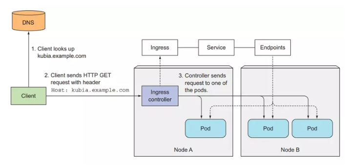

# Kubernetes(k8s)

Kubernetes (hay k8s) là một nền tảng open-source được dùng để quản lý container và được phát triển bởi google. Có thể dùng kubernetes để phát triển ứng dụng trên nhiều nền tảng khác nhau như on-premise, cloud, or virtual machines. Hiện nay kubernetes được sử dụng bởi nhiều công ty lớn trong việc vận hành phần mền, phát triển ứng dụng và có cộng đồng rất lớn.

## K8s giúp chúng ta vấn đề gì?

Với kubernetes chúng ta có thể group và quản lý container theo ứng dụng và project, nó cũng cung cấp tính năng Service Discovery and Load Balancing để chúng ta có thể dẫn request của ứng dụng tới đúng container, và cũng có tính năng giúp ứng dụng của chúng ta high available nhất có thể, khi một server vật lý gặp sự cố, nó có thể chuyển container của ta sang server vật lý khác. Ngoài ra kubernetes còn nhiều tính năng khác như: auto scale resource, auto restart application when failure, zero downtime deployment, automated rollouts and rollbacks application, v...v...

## Kiến trúc - các thành phần của k8s


Kubernetes cluster (một cụm bao gồm một master và một hoặc nhiều worker) bao gồm 2 thành phần (component) chính:
- Master nodes (control plane)
- Worker nodes

**Master nodes** bao gồm 4 thành phần chính là API server, controller manager, Scheduler, Etcd :
- API server: thành phần chính để giao tiếp với các thành phần khác
- Controller manager: gồm nhiều controller riêng cụ thể cho từng resource và thực hiện các chứng năng cụ thể cho từng thằng resource trong kube như create pod, create deployment, v...v...
- Scheduler: schedules ứng dụng tới node nào
- Etcd: là một database để lưu giữ trạng thái và resource của cluster

Master node chỉ có nhiệm vụ control state của cluster, nó không có chạy ứng dụng trên đó, ứng dụng của chúng ta sẽ được chạy trên worker node. **Worker node** gồm 3 thành phần chính như:
- Kubelet: giao tiếp với API server và quản lý container trong một worker node
- Container runtime (docker, rkt hoặc nền tảng khác): chạy container
- Kubernetes Service Proxy (kube-proxy): quản lý network và traffic của các ứng dụng trong woker node

## Kubernetes Pod: thành phần để chạy container

Pod là thành phần cơ bản nhất để deploy và chạy một ứng dụng, được tạo và quản lý bởi kubernetes. Pod được dùng để nhóm (group) và chạy một hoặc nhiều container lại với nhau trên cùng một worker node, những container trong một pod sẽ chia sẻ chung tài nguyên với nhau. Thông thường chỉ nên run Pod với 1 container


Kubernetes Pod như một wrapper của container, cung cấp cho chúng ta thêm nhiều chức năng để quản lý và chạy một container, giúp container của ta chạy tốt hơn là chạy container trực tiếp, như là group tài nguyên của container, check container healthy và restart, chắc chắn ứng dụng trong container đã chạy thì mới gửi request tới container đó, cung cấp một số lifecycle để ta có thể thêm hành động vào Pod khi Pod chạy hoặc shutdown, v...v... Và kubernetes sẽ quản lý Pod thay vì quản lý container trực tiếp

Ví dụ file `hello-kube.yaml`:
```
apiVersion: v1 # Descriptor conforms to version v1 of Kubernetes API
kind: Pod # Select Pod resource
metadata:
  name: hello-kube # The name of the pod
spec:
  containers:
    - image: 080196/hello-kube # Image to create the container
      name: hello-kube # The name of the container
      ports:
        - containerPort: 3000 # The port the app is listening on 
          protocol: TCP
```

Sử dụng kubectl CLI để chạy file config của Pod
```
kubectl apply -f hello-kube.yaml
```

Kiểm tra xem pod đã chạy chưa :
```
kubectl get po -o wide
```

Trước hết để test Pod, ta phải expose traffic của Pod để nó có thể nhận request trước, vì hiện tại Pod của chúng ta đang chạy trong local cluster và không có expose port ra ngoài


```
kubectl port-forward pod/hello-kube 3000:3000
```

### Phân chia tài nguyên của kubernetes cluster bằng cách sử dụng namespace

Namespace là cách để ta chia tài nguyên của cluster, và nhóm tất cả những resource liên quan lại với nhau, bạn có thể hiểu namespace như là một sub-cluster.
```
kubectl get ns
```

Namespace default là namespace chúng ta đang làm việc với nó, khi ta sử dụng câu lệnh kubectl get để hiển thị resource, nó sẽ hiểu ngầm ở bên dưới là ta muốn lấy resource của namespace mặc định. Ta có thể chỉ định resource của namespace chúng ta muốn bằng cách thêm option --namespace vào. Ta cũng có thể tạo namespace mới :
```
kubectl create ns testing
```

## ReplicationControllers and other controller

ReplicationControllers là một resource mà sẽ tạo và quản lý pod, và chắc chắn là số lượng pod nó quản lý không thay đổi và kept running. ReplicationControllers sẽ tạo số lượng pod bằng với số ta chỉ định ở thuộc tính replicas và quản lý pod thông qua labels của pod


Nếu chúng ta chạy cluster với hơn 1 worker node, RC sẽ giúp chúng ta giải quyết vấn đề này. Vì RC sẽ chắc chắn rằng số lượng pod mà nó tạo ra không thay đổi, nên ví dụ khi ta tạo một thằng RC với số lượng replicas = 1, RC sẽ tạo 1 pod và giám sát nó, khi một thằng worker node die, nếu pod của thằng RC quản lý có nằm trong worker node đó, thì lúc này thằng RC sẽ phát hiện ra là số lượng pod của nó bằng 0, và nó sẽ tạo ra thằng pod ở một worker node khác để đạt lại được số lượng 1
Cách hoạt động của Replication Controller


Ví dụ ta có một webservice, nếu ta chỉ deploy một pod để chạy ứng dụng, thì ta chỉ có 1 container để xử lý request của user, nhưng nếu ta dùng RC và chỉ định replicas = 3, ta sẽ có 3 pod chạy 3 container của ứng dụng, và request của user sẽ được gửi tới 1 trong 3 pod này, giúp quá trình xử lý của chúng ta tăng gấp 3 lần


### Sử dụng ReplicaSets thay thế ReplicationController

Đây là một resource tương tự như RC, nhưng nó là một phiên bản mới hơn của RC và sẽ được sử dụng để thay thế RC. Chúng ta sẽ dùng ReplicaSets (RS) để deploy pod thay vì dùng RC

Tạo file hello-rs.yaml :
```
apiVersion: apps/v1 # change version API
kind: ReplicaSet # change resource name
metadata:
  name: hello-rs
spec:
  replicas: 2
  selector:
    matchLabels: # change here 
      app: hello-kube
  template:
    metadata:
      labels:
        app: hello-kube
    spec:
      containers:
      - image: 080196/hello-kube
        name: hello-kube
        ports:
          - containerPort: 3000
```

Kiểm tra RS : 
```
kubectl get ns
```

### Sử dụng DaemonSets để chạy chính xác một pod trên một worker node

Đây là một resource khác của kube, giống như RS, nó cũng sẽ giám xác và quản lý pod theo lables. Nhưng thằng RS thì pod có thể deploy ở bất cứ node nào, và trong một node có thể chạy mấy pod cũng được. Còn thằng DaemonSets này sẽ deploy tới mỗi thằng node một pod duy nhất, và chắc chắn có bao nhiêu node sẽ có mấy nhiêu pod, nó sẽ không có thuộc tính replicas


## Services: expose traffic cho pod

Kubernetes Service là một resouce sẽ tạo ra một single, constant point của một nhóm Pod phía sau nó. Mỗi service sẽ có một địa chỉ IP và port không đổi, trừ khi ta xóa nó đi và tạo lại. Client sẽ mở connection tới service, và connection đó sẽ được dẫn tới một trong những Pod ở phía sau.

Pod là một resource rất phù du, nó sẽ được tạo ra, bị xóa, và thay thế bằng một thằng khác bất cứ lúc nào, có thể là lúc ta muốn đổi một template khác cho Pod, Pod cũ sẽ bị xóa đi và Pod mới sẽ được tạo ra. Hoặc là trường hợp một woker node die, Pod trên worker node đó cũng sẽ die theo, và một Pod mới sẽ được tạo ra trên woker node khác
Service có 4 loại chính là:
- ClusterIP
- NodePort
- ExternalName
- LoadBalancer

### ClusterIP

Là loại service sẽ tạo một IP và local DNS mà sẽ có thể truy cập ở bên trong cluster, không thể truy cập từ bên ngoài, được dùng chủ yếu cho các Pod ở bên trong cluster dễ dàng giao tiếp với nhau.

### NodePort

Đây là cách đầu tiên để expose Pod cho client bên ngoài có thể truy cập vào được Pod bên trong cluster. Giống như ClusterIP, NodePort cũng sẽ tạo endpoint có thể truy cập được bên trong cluster bằng IP và DNS, đồng thời nó sẽ sử dụng một port của toàn bộ worker node để client bên ngoài có thể giao tiếp được với Pod của chúng ta thông qua port đó. NodePort sẽ có range mặc định từ 30000 - 32767. Ví dụ:
```
apiVersion: v1
kind: Service
metadata:
  name: hello
spec:
  selector:
    app: hello-kube
  type: NodePort # type NodePort
  ports:
    - port: 80
      targetPort: 8080
      nodePort: 30123 # port of the worker node
```


Test gửi request tới Pod với địa chỉ 
```
http://<your_worker_node_ip>:<node_port>
```

### LoadBalancer

Khi bạn chạy kubernetes trên cloud, nó sẽ hỗ trợ LoadBalancer Service, nếu bạn chạy trên môi trường không có hỗ trợ LoadBalancer thì bạn không thể tạo được loại Service này. Khi bạn tạo LoadBalancer Service, nó sẽ tạo ra cho chúng ta một public IP, mà client có thể truy cập Pod bên trong Cluster bằng địa chỉ public IP này. Ví dụ
```
apiVersion: v1
kind: Service
metadata:
  name: kubia-loadbalancer
spec:
  selector:
    app: kubia
  type: LoadBalancer
  ports:
    - port: 80
      targetPort: 8080
```


### Ingress resource

Ingress là một resource cho phép chúng ta expose HTTP and HTTPS routes từ bên ngoài cluster tới service bên trong cluster của chúng ta. Ingress sẽ giúp chúng ta gán một domain thực tế với service bên trong cluster. Ví dụ:
```
apiVersion: extensions/v1beta1
kind: Ingress
metadata:
  name: kubia
spec:
  rules:
    - host: kubia.example.com # domain name
  http:
    paths:
      - path: /
        backend:
          serviceName: kubia-nodeport # name of the service inside cluster
          servicePort: 80
```



