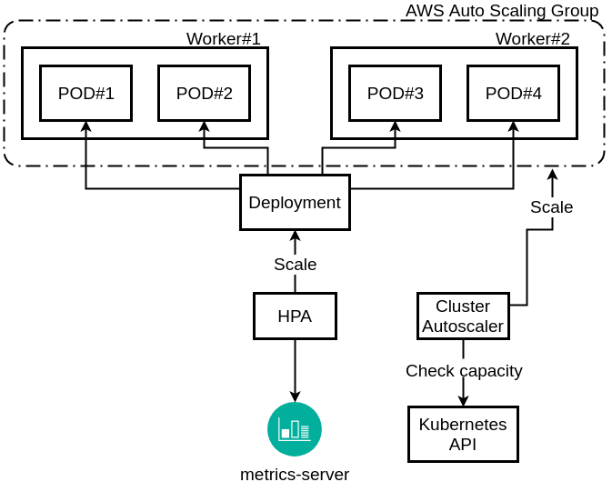

# HPA - Horizontal Pod Autoscaling

## Autoscaling ?

Là cách thức tự động tăng/giảm tài nguyên máy tính mà dược cấp cho app của chúng ta bấy kỳ thời điểm nào khi cần. Điều này giúp tạo ra những hệ thống trên clound và có khả năng mở rộng 24/24 nhằm đáp ứng nhu cầu sử dụng

## HPA là gì ?

Horizontal Pod Autoscaling - 1 bộ điều hành việc scale theo chiều ngang các Pod.

Lợi ích: đem lại kinh tế, tự động hóa việc tăng giảm cấu hình hệ thống phù hợp với các hệ thống có khối lượng tải biển đổi nhiều và khó dự đoán.

## Thiết lập HPA yêu cầu:

### 1. Metrics Server

Metrics server là 1 server tập hợp lại các metrics (chỉ số đo lường) của các container (các pods) phục vụ cho chu trình autoscaling tích hợp trong k8s.


Các bước trong hình:
- Bước 1 : Các metrics (mức sử dụng RAM, CPU, ...) được thu thập từ các Pods.
- Bước 2 : Các metrics này đẩy lên kubelet
- Bước 3 : Metrics Server thu thập metrics thông qua kubelet
- Bước 4 : Metrics đẩy lên API Server, HPA sẽ gọi API này để lấy metrics, tính toán để scale Pod.

### 2. Cluster Auto-scaler

Khi ban điều hành HPA tăng số lượng Pod, thì Node cũng cần phải tăng thêm để đáp ứng số pod này.

`Cluster Auto-Scaler` là 1 chức năng của K8s chịu trách nhiệm tăng/giảm số lượng node phù hợp với số pods vận hành.

`Cluster Auto-Scaler` sẽ điều chỉnh tự động kích thước của Kubernetes Cluster(hay số node) khi 1 trong các điều kiện sau thỏa mãn:
- Một số Pods run bị fail trong cluster do lý do không đủ tài nguyên.
- Có node trong cluster không được sử dụng hết công suất, các pods của nó có thể vận hành trên các node khác mà có tài nguyên đang dư giả.


### 3. Cách tính số pod cần scaler

Mỗi HPA có điều kiện riêng để kiểm tra, nếu điều kiện đó(CPU > 70%) đạt thì sẽ tiến hành scale up và khi điều kiện không còn thỏa mãn sẽ scale down. 

Số pod cần thiết sẽ tính bằng công thức:

**desiredReplicas = ceil[currentReplicas ( currentMetricValue / desiredMetricValue )]**

- Mặc định cứ 15s HPA sẽ lấy thông tin từ metric server để so sánh điều kiện, thời gian lấy thông tin được xác định bởi tham số `--horizontal-pod-autoscaler-sysnc-period`
- Nếu giá trị nhỏ hơn 1 thì sẽ mặc định tiếp tục lắng nghe trong 300s, nếu thông số vẫn < 1 thì sẽ tiến hành scale down từ từ. Giá trị thời gian tiếp tục lắng nghe được xác định bởi tham số `--horizontal-pd-downscale-stabilization`

### 4. Tổng thể chu trình việc scale



1. Metrics Server tổng hợp các thông số từ các pods hiện tại 
2. HPA sẽ check các thông số 15s/lần, nếu giá trị rơi vào khoảng thiết lập trong HPA thì nó sẽ tiến hành tăng/giảm sso lượng pods.
3. Trong trường hợp scale-up, k8s scheduler sẽ tạo 1 pods vào node mà có đủ tài nguyên mà pod yêu cầu.
4. Nếu ko đủ tài nguyên, Cluster auto-scaler sẽ tăng số node lên để đáp ứng với lượng pod mà đang được dự định tạo mới
5. Trường hợp scale-down, HPA sẽ giảm số lượng pod
6. Cluster scaler nếu thấy các node đang "rảnh", các pods của 1 node X nào đó có thể chuyển sang node khác để tận dụng tài nguyên thì pod sẽ chuyển sang, và node X đó sẽ được scale-down đi.

## Ưu điểm

- Được tích hợp sẵn nên tối ưu nhất cho các thành phần K8s.
- Thực hiện scale nhanh chóng.

## Nhược điểm

- Chỉ hỗ trợ 1 vài metric cơ bản (CPU, RAM, ...)

## Tạo file

```
apiVersion: autoscaling/v1
kind: HorizontalPodAutoscaler
metadata:
  name: rsapp-scaler
spec:
  scaleTargetRef:
    apiVersion: apps/v1
    kind: ReplicaSet
    name: rsapp
  minReplicas: 5
  maxReplicas: 10
  # Thực hiện scale CPU hoạt động ở 50% so với CPU mà POD yêu cầu
  targetCPUUtilizationPercentage: 50
```

## HPA Metrics

Các loại metrics hỗ trợ HPA scaler:
- CPU metrics :
    - CPU Usage (core) : Số lương CPU core dùng tại Pod
    - CPU Utilization(`per node`) (%) : Phần trăm của tổng số CPU của node được sử dụng bởi Pod
    - CPU Utilization(`per Request`) (%) : Tỉ lệ của tổng số CPU core được sử dụng bởi Pod và giá trị của Request được chỉ định của container trong Pod
    - CPU Utilization(`per Limit`) (%) : Tỉ lệ của tổng số CPU core được sử dụng bởi Pod và tổng số Limit được chỉ định của container trong Pod
- Disk metrics :
    - Disk Write Traffic (KB/s) : Tỉ lệ ghi Pod's disk
    - Disk Read Traffic (KB/s) : Tỉ lệ đọc Pod's disk
    - Disk Read IOPS (Time/s) : Số lần I/O Pod đọc dữ liệu từ disk
    - Disk Write IOPS (Time/s) : Số lần I/O Pod viết dữ liệu từ disk
- Network :
    - Inbound Network Bandwidth (Mbps) : Tổng băng thông đầu vào của tất cả container trên mỗi Pod.
    - Outbound Network Bandwidth (Mbps) : Tổng băng thông đầu ra của tất cả container trên mỗi Pod.
    - Inbound Network Traffic (KB/s) : Tổng lưu lượng truy cập vào của tất cả container trên mỗi Pod.
    - Outbound Network Traffic (KB/s) : Tổng lưu lượng truy cập ra của tất cả container trên mỗi Pod.
    - Network Packets In (Count/s) : Tổng các Packet gửi đến của tất cả container trên mỗi Pod.
    - Network Packets Out (Count/s) : Tổng các Packet gửi đi của tất cả container trên mỗi Pod.
- Memory :
    - Memory usage (MiB) : Dung lượng bộ nhớ được sử dụng bởi Pod
    - Memory Usage (`excluding cache`) (MiB) : Sử dụng bộ nhớ Pod, không bao gồm bộ nhớ cache
    - Memory Utilization (`per node`) (%) : Phân trăm tổng bộ nhớ của node được Pod sử dụng
    - Memory Utilization (`per node, excluding cache`) (%) : Phần trăm tổng bộ nhớ của node được Pod sử dụng, không bao gồm bộ nhớ cache
    - Memory Utilization (`per Request`) (%) : Phân trăm tổng bộ nhớ của Request được Pod sử dụng
    - Memory Utilization (`per Request, excluding cache`) (%) : Phân trăm tổng bộ nhớ của Request được Pod sử dụng, không bao gồm bộ nhớ cache
    - Memory Utilization (`per Limit`) (%) : Phân trăm tổng bộ nhớ Pod đến giá trị Limit
    - Memory Utilization (`per Limit, excluding cache`) (%) : Phân trăm tổng bộ nhớ Pod đến giá trị Limit, không bao gồm bộ nhớ cache
- GPU : 
    - GPU Usage (CUDA Core) : Sử dụng GPU Pod
    - GPU Applications (CUDA Core) : Ứng dụng GPU Pod
    - GPU Utilization (`per Request`) (%) : Phần trăm sử dung GPU so với giá trị Request
    - GPU Utilization (`per node`) (%) : Phần trăm sử dụng GPU trong node
    - GPU Memory Usage (MiB) : Sử dụng bộ nhớ GPU Pod
    - GPU Memory Applications (MiB) : Ứng dụng bộ nhớ GPU Pod
    - GPU Memory Utilization (`per Request`) (%) : Phần trăm sử dung bộ nhớ GPU so với giá trị Request
    - GPU Memory Utilization (`per node`) (%) : Phần trăm sử dụng bộ nhớ GPU trong node

Thời gian để cập nhật các Pod mới mặc định là 30s, ta có thể cấu hình với `--horizontal-pod-autoscaler-initial-readiness-delay`. Khi không có sự thay đổi về pod nào thì trong 5 phút pod sẽ giảm xuống, ta có thể cấu hình với `--horizontal-pod-autoscaler-cpu-initialization-period`.

Cấu hình mặc định:
```
behavior:
  scaleDown:
    stabilizationWindowSeconds: 300
    policies:
    - type: Percent
      value: 100
      periodSeconds: 15
  scaleUp:
    stabilizationWindowSeconds: 0
    policies:
    - type: Percent
      value: 100
      periodSeconds: 15
    - type: Pods
      value: 4
      periodSeconds: 15
    selectPolicy: Max
```

## Cài đặt

Cài đặt Metrics Server:
```
kubectl apply -f https://github.com/kubernetes-sigs/metrics-server/releases/latest/download/components.yaml
```

Kiểm tra trạng thái service vừa tài về:
```
kubectl -n kube-system get pod
```


Kiểm tra describe pod:
```
kubectl -n kube-system describe pod <metrics-server....>
```


Sửa lại metrics-server:
```
kubectl -n kube-system edit deploy metrics-server
```

Thêm phần `command` vào file
```
containers:
      - args:
        - --cert-dir=/tmp
        - --secure-port=4443
        - --kubelet-preferred-address-types=InternalIP,ExternalIP,Hostname
        - --kubelet-use-node-status-port
        - --metric-resolution=15s
        command:
        - /metrics-server
        - --kubelet-insecure-tls
        - --kubelet-preferred-address-types=InternalIP
```

Kiểm tra lại bằng lệnh:
```
kubectl top node
```

## Kịch bản 1

Run and expose php-apache server
### 1. Tạo file `php-apache.yaml`:
```
apiVersion: apps/v1
kind: Deployment
metadata:
  name: php-apache
spec:
  selector:
    matchLabels:
      run: php-apache
  replicas: 1
  template:
    metadata:
      labels:
        run: php-apache
    spec:
      containers:
      - name: php-apache
        image: registry.k8s.io/hpa-example
        ports:
        - containerPort: 80
        resources:
          limits:
            cpu: 500m
          requests:
            cpu: 200m
---
apiVersion: v1
kind: Service
metadata:
  name: php-apache
  labels:
    run: php-apache
spec:
  ports:
  - port: 80
  selector:
    run: php-apache
```

### 2. Tạo HPA 

- Tạo HPA bằng câu lệnh:
```
kubectl autoscale deployment php-apache --cpu-percent=50 --min=1 --max=10
```

- Tạo HPA bằng file hpa-php-apache.yaml
```
apiVersion: autoscaling/v1
kind: HorizontalPodAutoscaler
metadata:
  name: php-apache
spec:
  scaleTargetRef:
    apiVersion: apps/v1
    kind: Deployment
    name: php-apache
  minReplicas: 1
  maxReplicas: 10
  targetCPUUtilizationPercentage: 70
```

### 3. Tăng tải

```
kubectl run -i --tty load-generator --rm --image=busybox:1.28 --restart=Never -- /bin/sh -c "while sleep 0.01; do wget -q -O- http://php-apache; done"
```

Mở 1 màn hình mới chạy lệnh: 
```
kubectl get hpa php-apache --watch
```

### Autoscaling on multiple metrics and custom metrics

Sử dụng phiên bản `autoscaling/v2`, lấy YAML của HPA ở `autoscaling/v2` dạng:
```
kubectl get hpa php-apache -o yaml > /tmp/hpa-php-apache.yaml
```

Mở `/tmp/hpa-php-apache.yaml` và chỉnh sửa:
```
apiVersion: autoscaling/v2beta2
kind: HorizontalPodAutoscaler
metadata:
  name: php-apache
spec:
  # <--- START --->
  behavior:
    scaleDown:
      stabilizationWindowSeconds: 300
      policies:
      - type: Percent
        value: 100
        periodSeconds: 15
    scaleUp:
      stabilizationWindowSeconds: 0
      policies:
      - type: Percent
        value: 100
        periodSeconds: 15
      - type: Pods
        value: 4
        periodSeconds: 15
      selectPolicy: Max
      # <--- END --->
  scaleTargetRef:
    apiVersion: apps/v1
    kind: Deployment
    name: php-apache
  minReplicas: 1
  maxReplicas: 10
  metrics:
  - type: Resource
    resource:
      name: cpu
      target:
        type: Utilization
        averageUtilization: 50
  - type: Resource
    resource:
      name: memory
      target:
        type: AverageValue
        averageValue: 100Mi
```