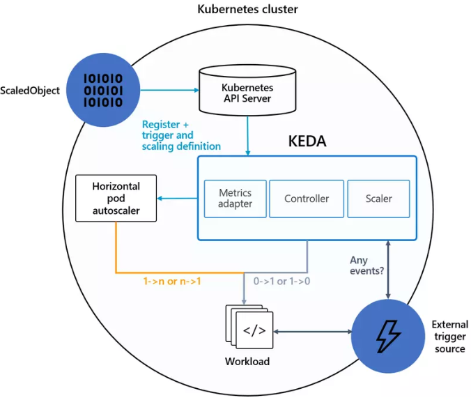

# KEDA

KEDA - Kubernetes-based Event Driven Autoscaler

## KEDA hoạt động như thế nào ?

KEDA hoạt động với vai trò như 1 Metric Server biên dịch các metric nhận được từ external server về cấu trúc mà HPA có thể hiểu được để tiến hành Scale qua HPA. Khi sử dụng KEDA ta sẽ không cần phải cài thêm metrics server từ k8s

KEDA có khái niệm ScaledObject, khi tạo ScaledObject cũng sẽ tự tạo thêm 1 HPA để thực hiện việc scale pod



## Cài đặt 

```
kubectl apply -f https://github.com/kedacore/keda/releases/download/v2.4.0/keda-2.4.0.yaml
```

## Tạo Scaled Object

Tạo ScaledObject để lấy metric từ Prometheus. Tạo file scaled-object.yaml:
```
apiVersion: keda.sh/v1alpha1
kind: ScaledObject
metadata:
  name: prometheus-scale
  namespace: default
spec:
  scaleTargetRef:
    name: appdeploy (1)
  minReplicaCount: 3 (2)
  maxReplicaCount: 10 (3)
  triggers:
  - type: prometheus (4)
    metadata:
      serverAddress: http://103.56.156.199:9090/ (5)
      metricName: total_http_request (6)
      threshold: '60' (7)
      query: sum(irate(by_path_counter_total{}[60s])) (8)
```

Giải thích:
- (1) : Tên của Deployment muốn scale
- (2) : Số lượng pod nhỏ nhất
- (3) : Số lượng pod lớn nhất
- (4) : Kiểu external server
- (5) : Địa chỉ external server
- (6) : Tên metric
- (7) : Giá trị sẽ gọi event (req/s > 60)
- (8) : Câu query lấy dữ liệu từ external server

## Ưu điểm

Chạy được nhiều loại metrics khác nhau

Tham khảo các loại metrics khác tại trang chủ của [KEDA](https://keda.sh/docs/2.4/scalers/)


## Nhược điểm

Tốn thêm 1 phần tài nguyên để chạy các thành phần của KEDA.